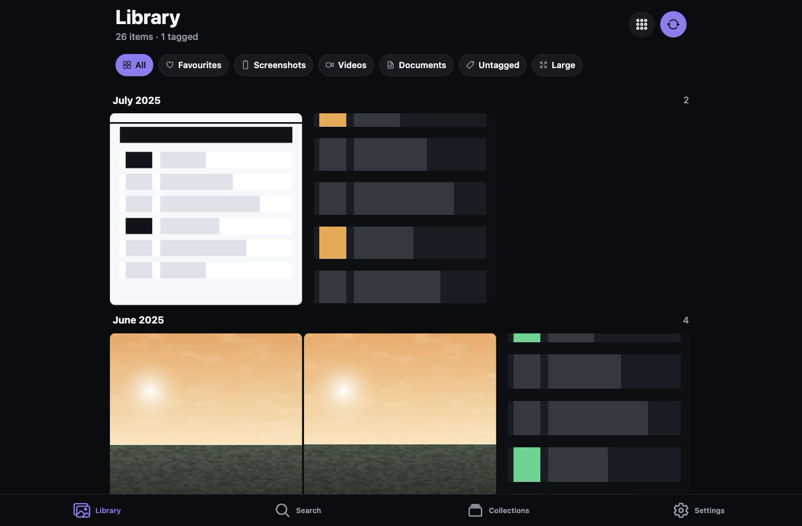
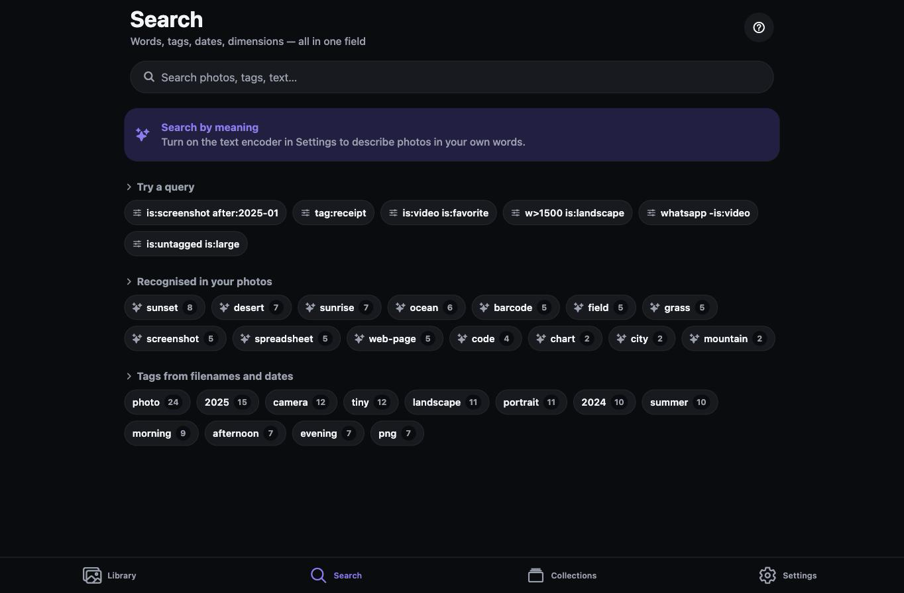
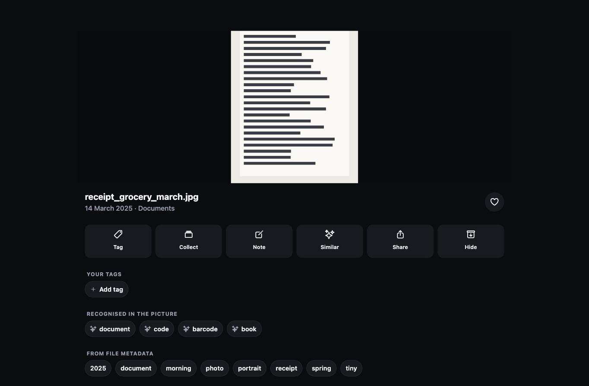
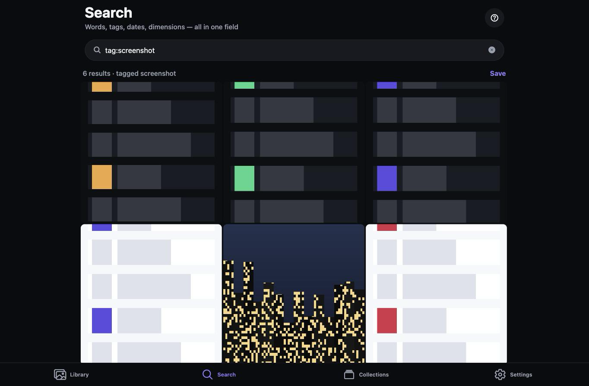
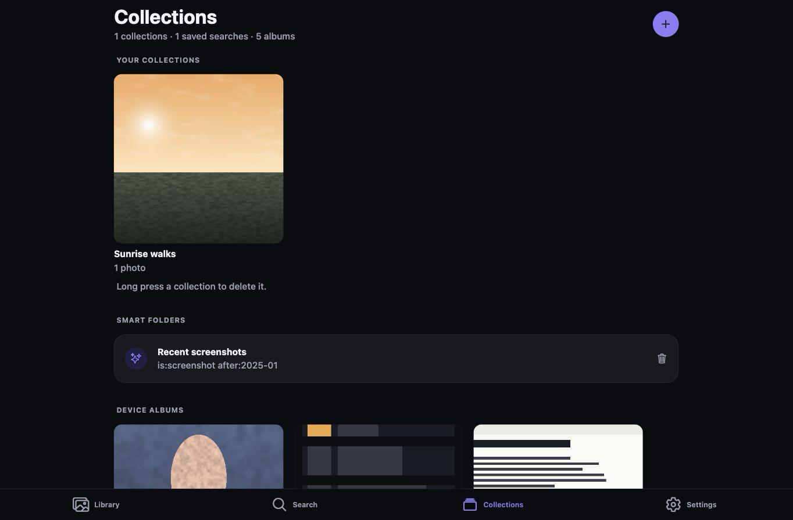
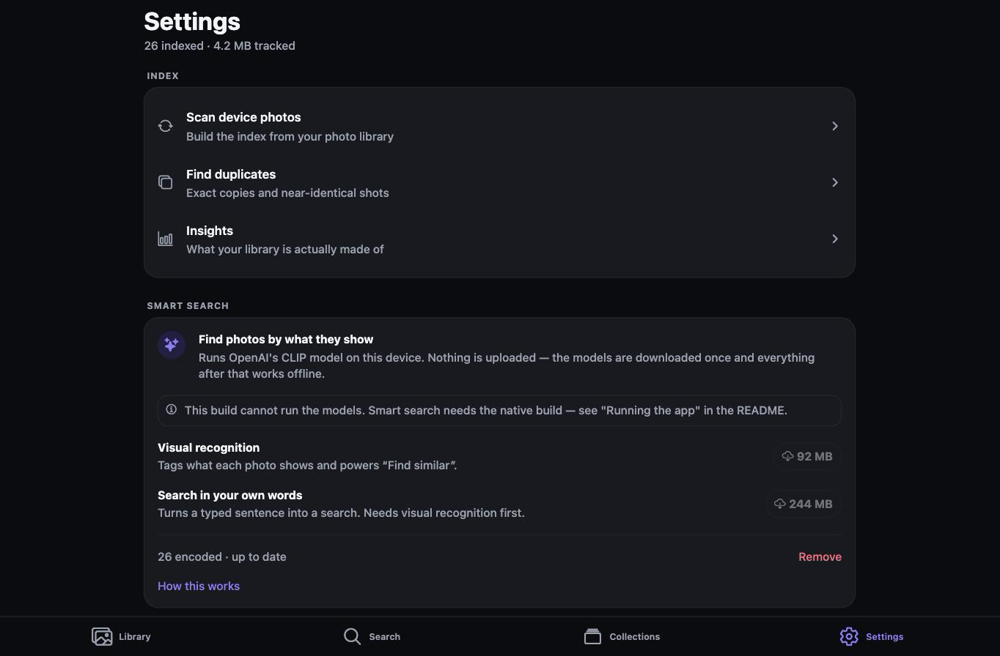
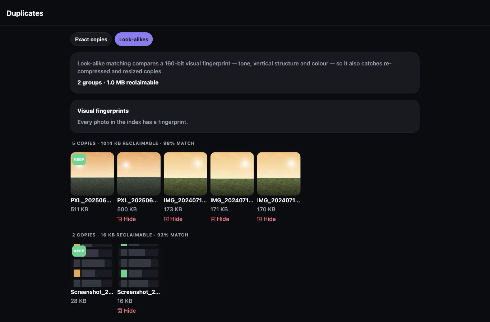
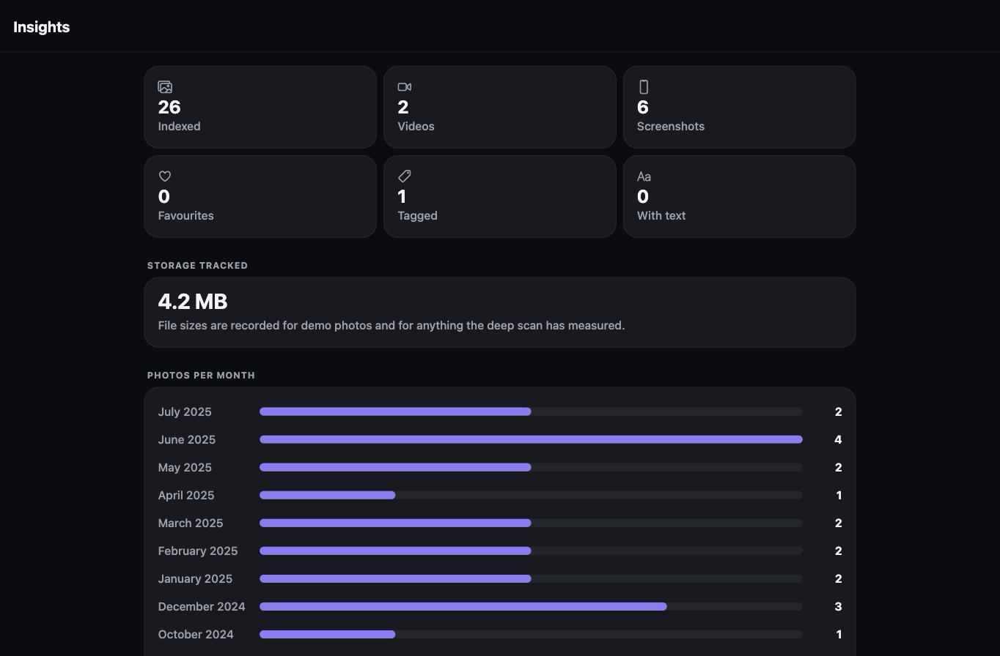
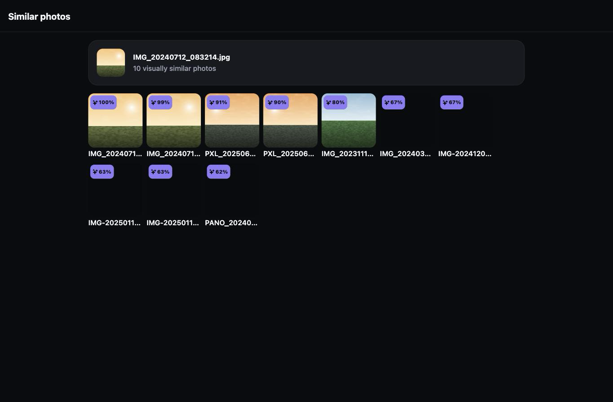

# Sift — image index & search

**Sift indexes every photo on your phone into a local SQLite database and makes
it searchable — by what the picture actually shows, and by word, tag, date,
shape, size or the text inside it.**

It is built for the problem Tidy leaves unsolved: a phone gallery is a pile of
thousands of files with no way to ask a precise question of it. Sift turns the
gallery into a queryable index, and runs **OpenAI's CLIP model on the device** so
you can search for *"sunset over a field"* and get the right photos even though
nothing about their filenames says so.

Everything happens on the device — no account, no upload, no network required
once the models are downloaded.

Module: **Mobile Applications (UFCF7H-15-3)** · React Native (Expo SDK 57) · Android

---

## Try it in two minutes

```bash
npm install
npm test            # 130 tests: query language, SQL builder, CLIP ranking, tagging rules
npm run web         # opens in a browser — no device or SDK needed
```

In the browser (or on any device): the Library starts empty — tap **“Try with
sample photos”**. 26 bundled photos are indexed instantly, already CLIP-encoded
and visually tagged, so search, visual tags, Find similar, duplicates and
insights all work immediately with nothing downloaded and no permissions.

For the full experience on Android — your own photos, live CLIP encoding,
searching in your own words — see [Installation & running](#installation--running).
The repo also ships 42 real Creative-Commons photographs (`test-photos/`, with
attribution in `SOURCES.json`); with an emulator or device connected,
`./scripts/load-test-photos.sh` pushes them into its photo library so
"Scan my photos" has something real to find.

**How this repo is tested.** `npm test` runs the same suite CI runs
(`.github/workflows/ci.yml`): pure unit tests for the query parser, SQL
builder, vector maths and tagging rules, plus integration tests that decode the
real bundled CLIP assets and assert recognition and ranking against known
answers — including genuine CLIP text vectors, so the whole text-to-image path
is exercised without the native model. Typecheck (`npm run typecheck`) and lint
(`npx expo lint`) are part of the same gate.

## Why this, and how it improves on Tidy

Tidy is a manual sorter: you look at pictures and file them one at a time. Sift
starts from the position that the phone already knows a great deal about every
photo, and that the bottleneck is *retrieval*, not filing.

| | Tidy | Sift |
|---|---|---|
| Organising | Manual, one photo at a time | CLIP recognises what each photo shows |
| Finding a photo | Scroll | Describe it in your own words, or use a query language |
| Understanding content | — | On-device CLIP: 113 visual concepts, zero-shot |
| "More like this" | — | Vector similarity over CLIP embeddings |
| Duplicates | — | Exact matching + 160-bit perceptual fingerprints |
| Text in screenshots | — | Optional OCR, folded into the search index |
| Grouping | Folders | Collections **and** saved searches that re-evaluate live |
| Understanding the library | — | Insights: composition, storage, timeline |
| Trying it out | Needs your photos | Bundled demo library, zero permissions |

---

## Screenshots

Captured from the running app on the Expo **web** target, which shares the same
components and layout code as the Android build. Smart-search screenshots show
the visual tags and similarity ranking working from the embeddings that ship
with the sample library; typing a natural-language query needs the native build,
because the model cannot run in a browser.

| Library | Search | Photo detail |
|---|---|---|
|  |  |  |

| Search results | Collections | Settings |
|---|---|---|
|  |  |  |

| Duplicates | Insights | Find similar |
|---|---|---|
|  |  |  |

---

## Installation & running

### Requirements

| To do this | You need |
|---|---|
| Run the tests and the browser demo | **Node.js 20+** and npm — nothing else |
| Run on Android (full app, live CLIP) | Java 17 (JDK), Android SDK (API 35+), and an emulator or a device in developer mode |
| Use an emulator on an Apple M4 Mac | An **Android 16 (API 36)** system image — older images advertise CPU features the hypervisor cannot run, which crashes any ML workload (Sift detects this and disables encoding instead of crashing) |

Smart search runs a native model, so the full app needs a **development
build** — it cannot run inside Expo Go. Everything except live CLIP encoding
also runs in Expo Go and in the browser.

```bash
git clone https://github.com/sudo-mko/memory-manager.git
cd memory-manager
npm install

npx expo prebuild --platform android   # generates ./android from app.json
npx expo run:android                   # builds and installs on device/emulator
```

The first `run:android` compiles the native modules and takes a few minutes.
After that, `npx expo start --dev-client` reloads JavaScript instantly.

### Running on an emulator

```bash
# One-off: create and boot a device
avdmanager create avd -n Sift_Pixel7 -k "system-images;android-35;default;arm64-v8a" -d pixel_7
emulator -avd Sift_Pixel7 &

npx expo run:android      # builds, installs and launches on the running emulator
```

The build compiles ExecuTorch's native C++, so the first run takes a while.
`android/gradle.properties` limits it to `arm64-v8a` — the one ABI an Apple
Silicon emulator and a modern phone both use — which turns four native
compilation passes into one.

### No Android SDK? Build an APK in the cloud

```bash
npm install -g eas-cli
eas login
eas build --platform android --profile preview   # produces a downloadable APK
```

Or build one locally with `./scripts/build-apk.sh`, which generates a signing
key on first run and writes `dist/sift-release.apk`.

### Without a native build

`npx expo start` (Expo Go) and `npm run web` both run the app with everything
except the CLIP models. Settings says so plainly rather than failing silently,
and the sample library still demonstrates visual tags and "Find similar",
because its embeddings are precomputed and shipped in the app.

### See every feature in under a minute

You do **not** need to grant photo access or have any photos on the device:

1. Open the app → **Settings** tab.
2. Turn on **Demo library**. 26 bundled sample photos are indexed instantly,
   already CLIP-encoded and visually tagged.
3. Go back to **Library** — the grid, filters, search, visual tags, "Find
   similar", duplicates and insights are all populated.

To search in your own words, download the encoders under **Settings → Smart
search** (92 MB, plus 244 MB for typed queries).

### Other commands

```bash
npm test           # 130 unit and integration tests
npm run typecheck  # TypeScript, strict mode
npm run lint
```

---

## Features

### Smart search (on-device CLIP)

CLIP is an OpenAI model trained on hundreds of millions of image/caption pairs.
It learned to place a picture and a sentence describing it near each other in one
shared 512-dimensional space. Sift uses that twice.

- **Describe what you want.** Type *"a sunset over a green field"* and the photos
  that look like one come back — ranked by distance in that space, not by any
  text stored about them.
- **Visual tags.** Every encoded photo is compared against 113 label vectors and
  tagged with what it shows: `sunset`, `document`, `screenshot`, `people`, `city`.
  Those tags feed straight into the existing `tag:` operator.
- **Find similar.** Any photo can be used as the query, which finds the same
  scene shot again, or a re-compressed copy, where filename and date cannot.
- **Both encoders run on device** through ExecuTorch. No photo and no query
  leaves the phone; after the one-time download the feature works in flight mode.

**Operators filter, meaning ranks.** `beach is:favorite after:2024-06` means "of
my favourites since June 2024, the ones that most look like a beach" — the SQL
narrows the candidates, CLIP orders them. Neither pure keyword nor pure vector
search does that, and a toggle above the results switches back to literal word
matching at any time.

**Two downloads, deliberately separate.** The image encoder is 92 MB (int8) and
gives you visual tags and "Find similar". The text encoder is 244 MB and is only
needed to encode a sentence you type. The label vectors themselves are computed
offline and ship inside the app, which is why the small half is useful alone.

**Honest limits.** Visual tags come from a fixed 113-concept vocabulary, so
anything outside it is not tagged — though typed queries are not restricted that
way. CLIP judges the whole frame, so a small object in a busy scene is easy to
miss, and it cannot read faces, names or dates. Tags are suggestions; your own
tags are never overwritten.

### Indexing
- **Incremental library scan.** Walks the device media library in pages of 200,
  writing each page into SQLite inside a transaction. Progress is reported live
  and the scan can be stopped at any point without corrupting the index.
- **Non-destructive re-scans.** Re-running a scan refreshes file metadata but
  never overwrites your tags, notes or favourites.
- **Automatic pruning.** Photos deleted from the device are dropped from the
  index — but only after a scan that ran to completion, so a cancelled scan can
  never wipe the library.

### Automatic tagging (offline, on device)
Every photo is tagged on the way into the index from evidence the phone already
has — no model, no network:
- **Filename conventions** — `Screenshot_`, `IMG_`, `PXL_`, `VID_`, `IMG-…-WA…`
  (WhatsApp), `PANO_`, scans, receipts, invoices, QR codes.
- **Album names** — Camera, Screenshots, Download, WhatsApp Images, Documents.
- **Shape** — portrait / landscape / square / panorama / tall, plus `high-res`
  and `thumbnail` from the pixel count.
- **Capture time** — year, morning / afternoon / evening / night, weekend, season.
- **Heuristic fallback** — a PNG at an exact phone aspect ratio is treated as a
  screenshot even if a chat app renamed it.

### Search
One field, one query language. Operators combine with AND, and anything Sift
does not recognise degrades into plain text rather than throwing an error.

| Syntax | Meaning |
|---|---|
| `beach sunset` | both words appear |
| `"family dinner"` | exact phrase |
| `-whatsapp` | exclude |
| `tag:receipts` / `-tag:meme` | has / lacks a tag |
| `album:Camera` | in that device album |
| `is:screenshot` `is:selfie` `is:video` `is:photo` | by kind |
| `is:favorite` `is:untagged` `is:text` | by your marks / has extracted text |
| `is:portrait` `is:landscape` `is:square` `is:panorama` `is:large` | by shape and size |
| `after:2024-01` `before:2025-03-01` `year:2024` `month:2024-05` | by date |
| `w>2000` `h<=500` `size>5mb` | by dimensions and file size |

Example: `is:screenshot after:2025-01 -tag:meme w>1000`

The Search tab also offers recent searches, worked examples, and every tag in
your library with its photo count.

### Organising
- **Tags** — add your own on a single photo, or on a whole multi-select.
- **Notes** — free text per photo, indexed and therefore searchable.
- **Collections** — manual groups that cut across device albums.
- **Saved searches** — smart folders that re-run their query every time you open
  them, so they stay correct as the library changes.
- **Multi-select** — long press in the grid, then favourite, tag or file in bulk.

### Duplicates
- **Exact copies** — same dimensions and byte size. Instant, straight off the index.
- **Look-alikes** — a 160-bit fingerprint (tone, vertical structure and colour) computed on device catches
  resized and re-compressed copies. Clustering additionally requires matching
  aspect ratios, and fingerprints with too little variation (a flat colour or a
  smooth gradient) are excluded because they cannot discriminate.
- Each group ranks the copy worth keeping first (favourite, then largest file,
  then most pixels, then earliest) and shows how much space the rest occupy.
- Removing a duplicate **hides it from Sift's index only**. Sift never deletes
  files from your device.

### Text in images (optional)
Off by default and never required. Add a free OCR.space API key in Settings and
the photo detail screen gains a **Read text** action; extracted text is written
into the index, so words inside a screenshot become searchable and `is:text`
starts matching. Loading, timeout, offline, rate-limit and unreadable-image
cases each produce their own message.

### Insights
Counts by kind, storage tracked, a twelve-month timeline drawn from a SQL
aggregate, the span of the library, and a prompt to work through untagged items.

### Interface
- Light, dark and system themes; 2/3/4-column grid; four sort orders — all persisted.
- Month-grouped grid with sticky headers.
- Accessibility labels, roles and states on every control; progress bars expose
  their value to screen readers.
- Haptic feedback (toggleable) and empty states that always offer a way forward.

---

## Technologies used

| Area | Choice |
|---|---|
| Framework | React Native 0.86 via **Expo SDK 57**, TypeScript (strict) |
| Navigation | **expo-router** — file-based, native stack + bottom tabs |
| State | **React Context + `useReducer`** (`SettingsProvider`, `LibraryProvider`) |
| Persistence | **expo-sqlite** for the index; **AsyncStorage** for preferences |
| Media | expo-media-library, expo-image, expo-image-manipulator, expo-asset |
| Image hashing | expo-image-manipulator + **jpeg-js** (dHash, pure JS) |
| Semantic search | **OpenAI CLIP ViT-B/32** on device via **react-native-executorch** (ExecuTorch) |
| Vector storage | 512-d float32 embeddings in a SQLite `BLOB` column |
| Optional API | **OCR.space** REST API (`fetch`, `AbortController` timeout) |
| Extras | expo-haptics, expo-sharing, expo-clipboard, @expo/vector-icons |
| Testing | **Jest** + jest-expo — 130 tests |

### Why this state architecture

The index can hold tens of thousands of rows, so the library context deliberately
does **not** mirror the photo list in memory. It holds aggregates (stats, tags,
albums, collections, scan progress) plus a `revision` counter. Screens run their
own queries through `usePhotoQuery`, which re-runs whenever `revision` changes.
Every mutation writes to SQLite and bumps the counter — one code path, no cache
to keep in sync, and the heap stays flat no matter how large the library is.

---

## Project structure

```
src/
  app/                     expo-router routes
    _layout.tsx            providers + native stack
    (tabs)/                Library · Search · Collections · Settings
    photo/[id].tsx         photo detail
    collection/[id].tsx    collection / saved search / album
    duplicates.tsx  insights.tsx  query-help.tsx
  components/              themed, reusable UI
  contexts/                settings-context, library-context
  db/                      schema, bootstrap, queries (photos, collections, saved searches)
  services/                indexer, auto-tag, phash, duplicates, ocr, demo-library
                           clip (model lifecycle), zero-shot (visual tags),
                           semantic-index (encoding pass), semantic-search (ranking)
  lib/                     query-parser, format, hash, vector  (pure, unit tested)
  hooks/                   use-photo-query, use-theme, use-haptics, use-debounced-value
  constants/theme.ts       design tokens
__tests__/                 Jest suites
assets/demo/               26 bundled demo images
assets/models/             precomputed CLIP label bank + sample-library embeddings
```

---

## Testing

`npm test` — 130 tests across eight suites, covering the logic that is easiest to
get quietly wrong:

| Suite | Covers |
|---|---|
| `query-parser` | tokenising, quoted phrases, negation, every operator, and graceful degradation of malformed input |
| `where-clause` | the SQL built from a parsed query, including that user text is always bound, never interpolated |
| `auto-tag` | each tagging rule, plus the cases it must *not* fire on |
| `hash` | bit packing, hamming distance, the low-entropy guard, base64 decoding |
| `format` | byte, date, duration and tag formatting at their edges |
| `vector` | cosine similarity, embedding serialisation, ranking, and the two separately calibrated relevance bands |
| `zero-shot` | the label-selection rule, including the cases where it must return nothing |
| `clip-assets` | decodes the real shipped label bank and sample embeddings, and asserts screenshots, documents and faces are actually recognised |
| `semantic-ranking` | the full text-to-image path, using real CLIP query vectors generated offline from the same weights the app loads |

Error handling was also exercised by hand on device and on web: denied photo
permission, cancelling a scan mid-run, an empty index, a query with no results,
a missing photo id, OCR with no key and with no network.

---

## Known issues & future improvements

**Known issues**
- Smart search needs a development build. Expo Go cannot load native modules, so
  the models are unavailable there — the app says so rather than failing quietly.
- The CLIP models are a 92 MB / 244 MB one-time download. They are stored in the
  app's own directory and can be removed again from Settings.
- Encoding runs at roughly 20–60 photos a minute on a mid-range phone, so a large
  library takes several passes. It is batched, cancellable and resumable for that
  reason.
- Live encoding is disabled on **emulators**: Apple M4-class hosts leak SME
  instructions into the guest that the hypervisor cannot execute, and XNNPACK's
  kernels die with an uncatchable SIGILL (verified with both the int8 and fp32
  encoders; the same failure class is documented in podman and .NET). The app
  detects this and says so instead of crashing; the sample library is
  pre-encoded, so every feature is still demonstrable in an emulator.
- On-device CLIP throughput has not been measured on a physical phone. The model
  lifecycle, encoding pass and ranking are covered by tests using real CLIP
  vectors; the models load and run through the same code path verified in the
  emulator up to the point of inference.
- Semantic ranking scores candidates in JavaScript. It is comfortable to a few
  thousand photos per query; beyond that it would need an approximate index.
- File sizes come from the OS only for demo assets and for photos the deep scan
  has measured, so *Storage tracked* under-reports until a deep scan has run.
- The fingerprint samples a 9×9 grid, so a small detail — one bright object in
  an otherwise similar scene — may not be enough to separate two photos that are
  alike overall. Look-alike groups are a suggestion to review, never an automatic
  action.
- Fingerprints with almost no variation (a flat colour, a very smooth gradient)
  carry no information, so they are excluded from look-alike matching rather than
  allowed to match everything.
- Demo videos use a still poster frame; the demo library ships images only.
- Look-alike clustering is O(n²) over fingerprinted photos. It is comfortable at
  a few thousand, but would need bucketing beyond that.
- Text extraction needs a network connection and a free third-party key.

**Future improvements**
- An approximate nearest-neighbour index (IVF or HNSW) so semantic ranking scales
  past a few thousand photos per query.
- A quantised text encoder — only the image encoder ships an int8 build today,
  which is why the typed-query half is the larger download.
- Let the user add their own concepts to the visual vocabulary by typing a phrase
  and encoding it once.
- On-device OCR through ExecuTorch's OCR model, removing the last cloud
  dependency (image labelling is already on device).
- Hash bucketing (BK-tree or prefix buckets) so look-alike search scales to
  100k+ photos.
- Background indexing so new photos are picked up without opening the app.
- Export a collection or a search result as a zip or a share sheet batch.
- Reverse-geocoded place tags from photo GPS metadata.
- A real bulk "delete from device" flow, with an explicit confirmation step.

---

## Reflection on the process

The project started from a critique rather than a feature list: Tidy (the app it
improves on) makes the user do the work of organising, and the interesting
question was how much of that work the phone could do by itself. That framing
drove every technical decision — SQLite over AsyncStorage because tags, notes
and embeddings are relational; a query language because filters compose where
checkboxes do not; on-device CLIP because semantic search is the one feature
that genuinely removes manual filing.

Three lessons stand out from the build:

- **Plan for the platform you cannot test on.** The single hardest bug was an
  uncatchable native crash (SIGILL) when running ML kernels inside an emulator
  on an Apple-Silicon host. It could not be fixed, only detected and designed
  around — which is why the sample library ships pre-computed embeddings, so
  every feature demonstrates even where the model cannot run. Building the
  fallback first would have saved days.
- **Pure logic pays for its keep.** Everything that could be a pure function
  (query parsing, SQL building, vector maths, tagging rules, hashing) lives in
  `src/lib` and `src/services` with no React or native imports, which is what
  makes 130 fast unit and integration tests possible. The parts that were
  hardest to test were exactly the parts entangled with native modules.
- **Honest degradation beats silent failure.** Expo Go cannot load the models,
  emulators cannot run them, OCR needs a network — each of these states gets its
  own explicit message in the UI. Writing those messages forced clearer thinking
  about the feature boundaries than the happy path ever did.

Given more time, the first improvement would be an approximate nearest-neighbour
index, because it is the one scaling limit a real user with a 20,000-photo
library would actually hit.

---

## Privacy

Sift reads your photo library to build an index on your device. The index lives
in a SQLite file inside the app's own storage. Nothing is uploaded and there is
no account.

Smart search does not change that. The CLIP models are downloaded once from
Hugging Face and then run locally — your photos and your search phrases are never
sent anywhere.

The single optional exception is text extraction: if — and only if — you add an
OCR key and tap **Read text**, that one image is sent to OCR.space to be read.
Everything else works with the device in aeroplane mode.
